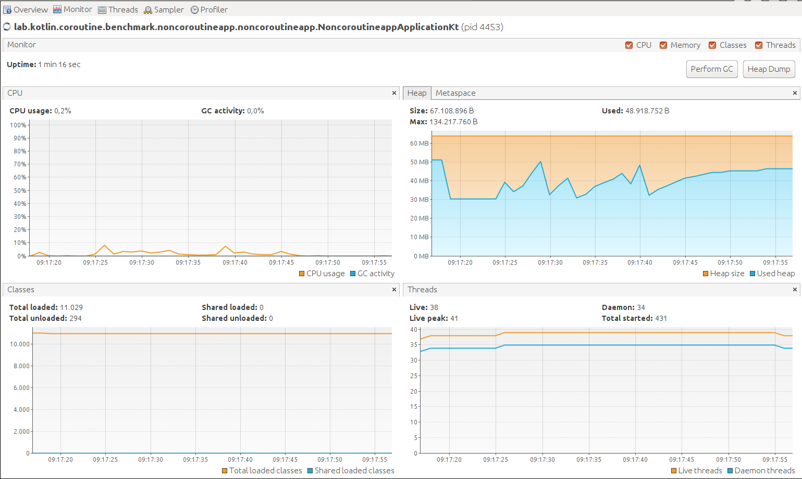

# Kotlin Coroutine Benchmark

## Description
This is a simple benchmark to compare kotlin coroutine rest service against non-coroutine one.
It also serves as a SpringBoot Coroutine sample application.

## Objectives
Compare nonblocking coroutines and thread-pee-request approaches. 
There is no concern about stressing the throughput, the endpoint under test is very simple, the goal is compare the results with and without coroutines.

## Endpoint under test
The service under test is very simple. It simulates a service calling 3 others micro-services to compose a new object, 
save it into mongodb and returns it to the client.

The goal is simulate an endpoint with some IOs and a little of CPU usage.

The endpoint has two methods */execute* and */executeAsync*, the only differences is that
/executeAsync does the GETs to external service in parallel and */execute* does it in sequence.

#### /execute - with parallel calls


#### /executeAsync - without parallel calls


## Applications

### NonCoroutineApp
SpringBoot application using thread-per-request (blocking) approach. 

- [execute\(\)](https://github.com/mmoraesbr/kotlin-coroutine-benchmark/blob/master/noncoroutineapp/src/main/kotlin/lab/kotlin/coroutine/benchmark/noncoroutineapp/noncoroutineapp/service/Service.kt#L18)
- [executeAsync\(\)](https://github.com/mmoraesbr/kotlin-coroutine-benchmark/blob/master/noncoroutineapp/src/main/kotlin/lab/kotlin/coroutine/benchmark/noncoroutineapp/noncoroutineapp/service/Service.kt#L30)

*executeAsync() was implemented using *@Async* SpringBoot *annotation*. [code](noncoroutineapp/src/main/kotlin/lab/kotlin/coroutine/benchmark/noncoroutineapp/noncoroutineapp/service/ExternalService.kt#L38) 

coroutineapp/src/main/kotlin/lab/kotlin/coroutine/benchmark/coroutineapp/coroutineapp/service/Service.kt#L32

### CoroutineApp
SpringBoot application using coroutine (nonblocking) approach. 

- [execute\(\)](coroutineapp/src/main/kotlin/lab/kotlin/coroutine/benchmark/coroutineapp/coroutineapp/service/Service.kt#L20)
- [executeAsync\(\)](coroutineapp/src/main/kotlin/lab/kotlin/coroutine/benchmark/coroutineapp/coroutineapp/service/Service.kt#L32)

## Running

### Start local mongodb

```
$ cd kotlin-coroutine-benchmark/docker
$ docker-compose up
```

### Start NonCoroutine application

```
$ cd kotlin-coroutine-benchmark/noncoroutineapp
$ ./gradlew bootRun
```

### Start Coroutine application

```
$ cd kotlin-coroutine-benchmark/coroutineapp
$ ./gradlew bootRun
```

## Considerations
The tests was executed on my machine with jmeter, springboot app and a local mongodb.
The endpoint simulating an external service is on http://mocky.io site. 

My machine is an intel core i7 8th and 4 cores with 16mb of RAM.

## JMeter Test

| Parameter           | Value      |
|--------------------|------------|
| Concurrent users   | 20         |
| Loop count         | 10         |
| Time between calls | 300ms      |


## Results 

### General Summary

| Scenario                                 | Thoughtput |   Time  |                                      |
|------------------------------------------|------------|---------|--------------------------------------|
| */executeAsync* Coroutine 128MB of memory   | 32.5/sec  |  6 secs |[details](#executeAsync-Coroutine-128MB-of-memory)   |
| */executeAsync* Coroutine 64MB of memory    | 24.4/sec  |  8 secs |[details](#executeAsync-Coroutine-64MB-of-memory)    |
| */executeAsync* NonCoroutine 128MB of memory| 21.2/sec  |  9 secs |[details](#executeAsync-NonCoroutine)                |
| */executeAsync* NonCoroutine 64MB of memory | 21.1/sec  |  9 secs |[details](#executeAsync-NonCoroutine-64MB-of-memory) |
| */execute* Coroutine 128MB of memory        | 15.9/sec  | 12 secs |[details](#execute-Coroutine-128MB-of-memory)        |
| */execute* NonCoroutine 128MB of memory     | 15.0/sec  | 13 secs |[details](#execute-NonCoroutine-128MB-of-memory)     |
| */execute* Coroutine 64MB of memory         | 15.1/sec  | 13 secs |[details](#execute-Coroutine-64MB-of-memory)         |
| */execute* NonCoroutine 64MB of memory      |  8.1/sec  | 25 secs |[details](#execute-NonCoroutine-64MB-of-memory)      |

### Testing with 128MB of ram

#### /execute NonCoroutine 128MB of memory <a name="execute-NonCoroutine-128MB-of-memory" />

| Meter            | Value      |
|------------------|------------|
| Time to complete | 13 seconds |
| Throughput       | 15/sec     |


##### JVM Monitor


##### JMeter Summary


#### /executeAsync NonCoroutine 128MB of memory <a name="executeAsync-NonCoroutine"></a>

| Meter            | Value      |
|------------------|------------|
| Time to complete |  9 seconds |
| Throughput       |   21.2/sec |


##### JVM Monitor


##### JMeter Summary


#### /execute Coroutine 128MB of memory <a name="execute-Coroutine-128MB-of-memory" />

| Meter            | Value      |
|------------------|------------|
| Time to complete | 12 seconds |
| Throughput       | 15.9/sec   |


##### JVM Monitor


##### JMeter Summary


#### /executeAsync Coroutine 128MB of memory <a name="executeAsync-Coroutine-128MB-of-memory">

| Meter            | Value      |
|------------------|------------|
| Time to complete | 6 seconds  |
| Throughput       | 32.5/sec   |


##### JVM Monitor


##### JMeter Summary


### Testing with 64MB of ram

#### /execute NonCoroutine 64MB of memory <a name="execute-NonCoroutine-64MB-of-memory" />

| Meter            | Value      |
|------------------|------------|
| Time to complete | 25 seconds |
| Throughput       | 8.1/sec     |


##### JVM Monitor



##### JMeter Summary


#### /executeAsync NonCoroutine 64MB of memory           <a name="executeAsync-NonCoroutine-64MB-of-memory" />

| Meter            | Value      |
|------------------|------------|
| Time to complete | 9 seconds  |
| Throughput       | 21.1/sec   |


##### JVM Monitor


##### JMeter Summary


#### /execute Coroutine 64MB of memory <a name="execute-Coroutine-64MB-of-memory"/>

| Meter            | Value      |
|------------------|------------|
| Time to complete | 13 seconds |
| Throughput       | 15.1/sec   |


##### JVM Monitor


##### JMeter Summary


#### /executeAsync Coroutine 64MB of memory <a name="executeAsync-Coroutine-64MB-of-memory">

| Meter            | Value      |
|------------------|------------|
| Time to complete | 8 seconds  |
| Throughput       | 24.4/sec   |


##### JVM Monitor


##### JMeter Summary


